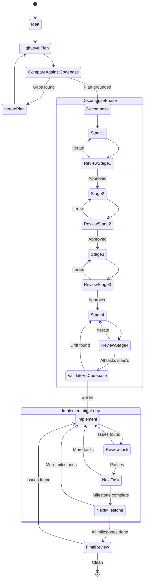
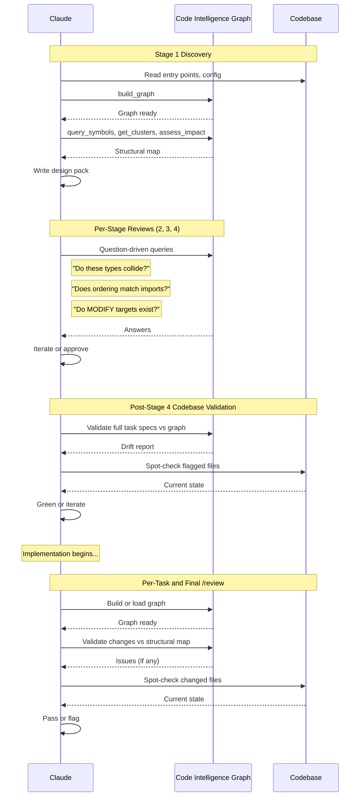

# Progressive Decomposition -- Validated Flow

**Last updated:** 2026-03-13
**Based on:** Multiple test runs across greenfield and brownfield projects, including admin UI (M01 implementation + /review), AI assistant enhancement (11 issues caught across 6 milestones), and feature catalog decomposition from vague prompt.

---

## The Flow

The critical insight from testing: review checkpoints belong at every stage of decomposition, not just after the plan is complete. Claude consistently catches structural issues, naming collisions, and assumption drift when given a review pass between stages.

### What each review catches

Per-stage reviews during decomposition are lightweight -- they are not full /review invocations. They are "read what was just written, check it against what exists, flag problems before the next stage builds on bad assumptions." The full /review command (Claude Code native) is used during implementation.

Observed catches from test runs:

- **Stage 1 review:** Missing domain concepts, incorrect assumptions about existing architecture, blind spots in dependency mapping.
- **Stage 2 review:** Type name collisions with existing exports, interface signatures that don't match the codebase's conventions, missing error types.
- **Stage 3 review:** Milestone ordering that contradicts actual import graph, understated dependencies between milestones.
- **Stage 4 review:** MODIFY targets that no longer exist or have changed signatures, acceptance criteria that duplicate what already exists.
- **Post-Stage 4 codebase validation:** The most important checkpoint. Compares the full task spec set against the live codebase. Catches drift that accumulated across stages.
- **Per-task /review:** Real bugs -- Decimal serialization issues, pagination cursor mismatches, non-atomic Redis operations, double-serialization, non-generator yield bugs. These are code-level issues the decomposition cannot predict.
- **Final /review:** Cross-cutting concerns -- error handling consistency, missing index migrations, configuration gaps across the full scope of changes.

---

## Code Intelligence Insertion Points

For larger codebases, code intelligence (graph indexing, symbol queries, dependency mapping, impact analysis) slots into the flow as a query tool, not a workflow tool. Claude uses its native tools for reading, writing, and navigating. The graph answers questions that brute-force exploration cannot answer efficiently at scale.

### Primary touchpoints

1. **During /decompose (Stage 1 discovery)** -- build the graph at the start. Claude uses it to understand the codebase: what exists, how it connects, where the boundaries are. query_symbols, get_clusters, and assess_impact answer questions Claude cannot answer by reading files one at a time in a 3000+ file project.

2. **During per-stage reviews** -- when the SKILL.md poses questions like "do these type names collide with existing exports?" or "does milestone ordering contradict the import graph?", code intelligence tools are the efficient way to answer them. Usage here is question-driven, not directive-driven.

3. **During post-Stage 4 codebase validation** -- validate the full task spec set against the actual dependency graph. Does the MODIFY list match reality? Have files changed since decomposition started?

4. **During /review (implementation validation)** -- build or load the graph to validate changes against the structural map. Catches drift between what was planned and what was built.

### Scale context

The methodology works without code intelligence on small codebases (tested on ~46-file projects). At scale (2,266 files, 22,487 edges -- the dusk target), brute-force exploration will not work. Code intelligence becomes load-bearing for execution while the methodology remains load-bearing for planning.

---

## Open Question: Review Automation via A2A

The manual review process -- particularly the per-stage reviews during decomposition -- is where delegated review could add value. The idea: instead of the same Claude session reviewing its own output, delegate the review to another agent (another Claude session, Gemini, Codex) via A2A protocol. This provides a genuine second opinion rather than self-review.

Current assessment: the complexity cost is high relative to the benefit. Self-review already catches real issues (the test data proves this). Cross-agent review would catch different issues -- but building the A2A infrastructure to route review requests, share context, and merge findings is the same multi-agent coordination problem that Recommendation 3 shelved.

The pragmatic path: keep the self-review checkpoints working well. If testing reveals a class of issues that self-review consistently misses, that becomes the signal to revisit A2A-delegated review.
